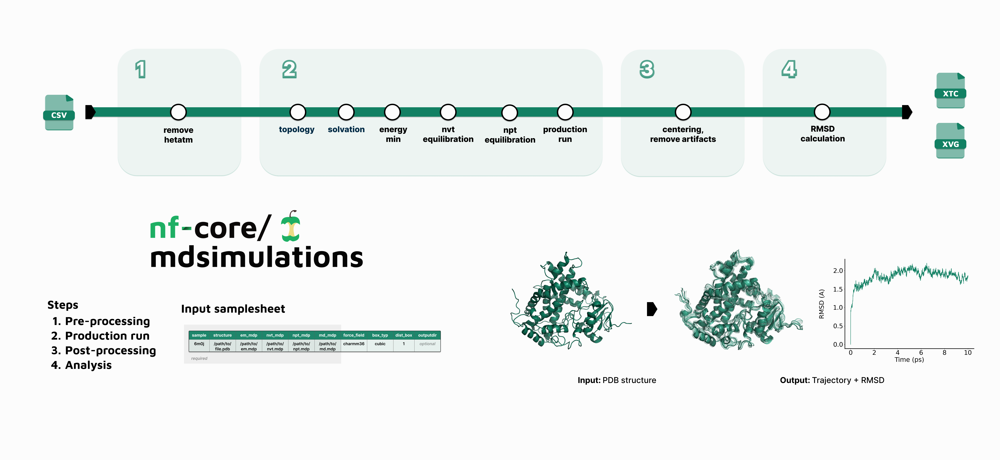

<h1>
  <picture>
    <source media="(prefers-color-scheme: dark)" srcset="docs/images/nf-core-mdsimulations_logo_dark.png">
    
  </picture>
</h1>

👩‍💻 I'm working on it, so please be patient.


[](https://github.com/nf-core/mdsimulations/actions/workflows/nf-test.yml)
[](https://github.com/nf-core/mdsimulations/actions/workflows/linting.yml)[](https://nf-co.re/mdsimulations/results)[](https://doi.org/10.5281/zenodo.XXXXXXX)
[](https://www.nf-test.com)

[](https://www.nextflow.io/)
[](https://github.com/nf-core/tools/releases/tag/3.3.2)
[](https://docs.conda.io/en/latest/)
[](https://www.docker.com/)
[](https://sylabs.io/docs/)
[](https://cloud.seqera.io/launch?pipeline=https://github.com/nf-core/mdsimulations)

[](https://nfcore.slack.com/channels/mdsimulations)[](https://bsky.app/profile/nf-co.re)[](https://mstdn.science/@nf_core)[](https://www.youtube.com/c/nf-core)

# Introduction

**nf-core/mdsimulations** is a bioinformatics pipeline for running molecular dynamic simulations (MD) using GROMACS open-source software. This workflow enables researchers to perform standard protein simulations in a fully automated manner, with minimal configuration, on both local and high-performance computing (HPC) environments. 

We are currently working on the following tasks:
1.  🚀📆 Official release of the `nf-core/mdsimulations` pipeline.
2.  🛠👩‍💻 Expanding the pipeline’s capabilities to include more analysis modules (e.g., RMSF, distances), and integrating specialized tools for membrane proteins and protein-ligand complexes.
3.  📚📝 Generating a comprehensive test dataset.


<!-- TODO nf-core:
   Complete this sentence with a 2-3 sentence summary of what types of data the pipeline ingests, a brief overview of the
   major pipeline sections and the types of output it produces. You're giving an overview to someone new
   to nf-core here, in 15-20 seconds. For an example, see https://github.com/nf-core/rnaseq/blob/master/README.md#introduction
-->

# Pipeline 

<h1>
  <picture>
    <source media="(prefers-color-scheme: dark)" srcset="docs/images/pipeline_v1.png">
    
  </picture>
</h1>


The `nf-core/mdsimulations` pipeline automates a standard GROMACS MD simulation workflow. The major steps are:
*   **Input pre-processing:** From the PDB structure, remove the missing atoms.
*   **Production run:** Main subworkflow of the pipeline. 
    *   **Generation of molecular topology**,
    *   **System solvation**, and ion addition to neutralize the system.
    *   **Energy Minimization:** Removal of steric clashes and relaxation of the initial structure.
    *   **Equilibration:** NVT (constant Number, Volume, Temperature) and NPT (constant Number, Pressure, Temperature) equilibration to bring the system to the desired temperature and density.
    *   **Production MD:** Execution of the main molecular dynamics simulation.
*   **Post-processing:** Centering the protein and remove periodic boundary condition (PBC).
*   **Analysis:** Preliminary analysis of the Root-Mean-Square Deviation (RMSD).


# Usage
[👩‍💻 working on it]

> [!NOTE]
> If you are new to Nextflow and nf-core, please refer to [this page](https://nf-co.re/docs/usage/installation) on how to set-up Nextflow. Make sure to [test your setup](https://nf-co.re/docs/usage/introduction#how-to-run-a-pipeline) with `-profile test` before running the workflow on actual data.

<!-- TODO nf-core: Describe the minimum required steps to execute the pipeline, e.g. how to prepare samplesheets.
     Explain what rows and columns represent. For instance (please edit as appropriate):

First, prepare a samplesheet with your input data that looks as follows:

`samplesheet.csv`:

```csv
sample,fastq_1,fastq_2
CONTROL_REP1,AEG588A1_S1_L002_R1_001.fastq.gz,AEG588A1_S1_L002_R2_001.fastq.gz
```

Each row represents a fastq file (single-end) or a pair of fastq files (paired end).

-->

<!-- First, prepare a samplesheet with your input PDB files that looks as follows:

`samplesheet.csv`:

```csv
sample,pdb_file
my_protein_A,path/to/my_protein_A.pdb
my_protein_B,path/to/my_protein_B.pdb
```

Now, you can run the pipeline using:

```bash
nextflow run nf-core/mdsimulations \
   -profile <docker/singularity/.../institute> \
   --input samplesheet.csv \
   --outdir <OUTDIR>
``` -->

> [!WARNING]
> Please provide pipeline parameters via the CLI or Nextflow `-params-file` option. Custom config files including those provided by the `-c` Nextflow option can be used to provide any configuration _**except for parameters**_; see [docs](https://nf-co.re/docs/usage/getting_started/configuration#custom-configuration-files).

For more details and further functionality, please refer to the [usage documentation](https://nf-co.re/mdsimulations/usage) and the [parameter documentation](https://nf-co.re/mdsimulations/parameters).

# Pipeline output
[👩‍💻 working on it]

To see the results of an example test run with a full size dataset refer to the [results](https://nf-co.re/mdsimulations/results) tab on the nf-core website pipeline page.
For more details about the output files and reports, please refer to the
[output documentation](https://nf-co.re/mdsimulations/output).

# Credits

nf-core/mdsimulations has been developed by Sara Tolosa Alarcón ([@sarata00](https://github.com/sarata00)) from the [Computational Biology Group](https://www.bsc.es/discover-bsc/organisation/scientific-structure/computational-biology) at the [Barcelona Supercomputing Center](https://www.bsc.es/) under the [deCYPher project](https://www.decypher.bio/) and supervision of Miguel Romero-Durana ([@migromero](https://github.com/migromero)).

# Contributions and Support
[👩‍💻 working on it]


If you would like to contribute to this pipeline, please see the [contributing guidelines](.github/CONTRIBUTING.md).

For further information or help, don't hesitate to get in touch on the [Slack `#mdsimulations` channel](https://nfcore.slack.com/channels/mdsimulations) (you can join with [this invite](https://nf-co.re/join/slack)).

# Citations
[👩‍💻 working on it]


<!-- TODO nf-core: Add citation for pipeline after first release. Uncomment lines below and update Zenodo doi and badge at the top of this file. -->
<!-- If you use nf-core/mdsimulations for your analysis, please cite it using the following doi: [10.5281/zenodo.XXXXXX](https://doi.org/10.5281/zenodo.XXXXXX) -->

<!-- TODO nf-core: Add bibliography of tools and data used in your pipeline -->

An extensive list of references for the tools used by the pipeline can be found in the [`CITATIONS.md`](CITATIONS.md) file.

You can cite the `nf-core` publication as follows:

> **The nf-core framework for community-curated bioinformatics pipelines.**
>
> Philip Ewels, Alexander Peltzer, Sven Fillinger, Harshil Patel, Johannes Alneberg, Andreas Wilm, Maxime Ulysse Garcia, Paolo Di Tommaso & Sven Nahnsen.
>
> _Nat Biotechnol._ 2020 Feb 13. doi: [10.1038/s41587-020-0439-x](https://dx.doi.org/10.1038/s41587-020-0439-x).
